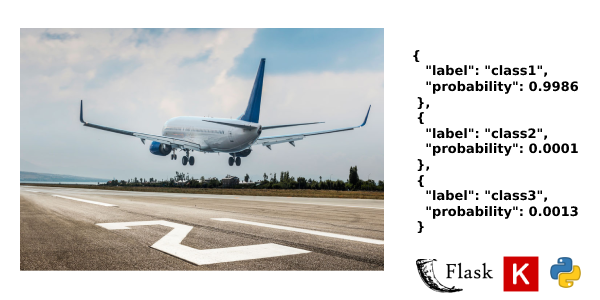

# Project Details

## Serve your image classification model with Flask/Gunicorn (KERAS)

### Keras -the high-level API of TensorFlow- is powerful and easy to use library for developing deep learning models. We will create an API to classify images and we assume that our model is trained and ready-to-use.

# &nbsp;


<p float="left">
  
</p>


## Installation

Use the package manager [pip](https://pip.pypa.io/en/stable/) to install requirements.

```bash
pip3 install -r requirements.txt
```

## Usage
### Run 
```
gunicorn --bind 0.0.0.0:5000 wsgi:app
```

### Test with samples (file / url)
```
python3 test.py -s url -p https://www.traveller.com.au/content/dam/images/h/1/q/k/x/8/image.related.articleLeadwide.620x349.h1qkx3.png/1599540163360.jpg

python3 test.py -s file -p tests/test_image.png

```

# &nbsp;

## Contributing
Pull requests are welcome. For major changes, please open an issue first to discuss what you would like to change.

## License
[MIT](https://choosealicense.com/licenses/mit/)

# &nbsp;

#### Tested with following environments

##### Ubuntu 18.04 & python3.6

##### macOS Mojave 10.14.5 & python 3.6
